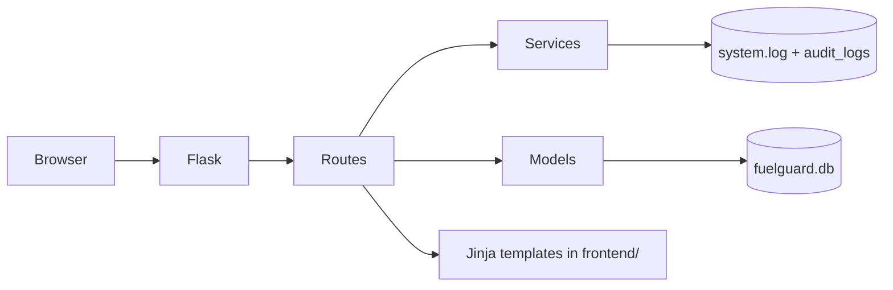

# FuelGuard — Architecture & Project Layout

This document describes the production-oriented layout of FuelGuard after the backend/frontend split, the purpose of each area, and cleanup notes for academic review.

## 1. Folder tree (high level)

```text
project_root/
├── app.py                      # Entry: delegates to backend.app.main
├── config.py                   # Thin re-export of backend.config.settings
├── ARCHITECTURE.md             # This file
├── backend/
│   ├── app.py                  # Flask factory, blueprints, error handlers
│   ├── config/
│   │   ├── __init__.py
│   │   └── settings.py       # Config, TestConfig, paths, secrets, LOGS_DIR
│   ├── database/
│   │   ├── fuelguard.db      # Default SQLite file (created at runtime)
│   │   └── schema.sql        # Reference schema (from iterdump after init)
│   ├── extensions.py         # CSRF extension instance
│   ├── logs/
│   │   └── system.log        # Append-only operational log
│   ├── middleware/           # JWT guard + RBAC shim
│   ├── models/               # SQLite persistence (per domain)
│   ├── routes/               # HTTP blueprints (thin controllers)
│   ├── security/             # Hashing, sessions, RBAC, CSRF, audit facade
│   ├── services/             # Business helpers, JWT, validation, logging
│   └── utils/                # DB shim, validators re-export, helpers
├── frontend/                 # Jinja templates + static assets only
│   ├── assets/
│   │   ├── css/              # styles.css, landing.css
│   │   ├── js/               # main.js, validation.js, feature scripts
│   │   └── images/           # Brand assets
│   ├── admin/                # Admin HTML + admin.js
│   ├── manager/              # Manager HTML + manager.js
│   ├── accountant/         # Accountant HTML + accountant.js
│   ├── sales/                # Sales HTML + sales.js
│   └── shared/               # Landing, login, error, nav fragments
└── tests/                    # Pytest suite (kept for academic evaluation)
```

## 2. Folder roles

| Location | Role |
|----------|------|
| `backend/app.py` | Builds the Flask app: `template_folder` → `frontend/`, `static_folder` → `frontend/assets`, registers blueprints, wires teardown and error pages. |
| `backend/config/` | Central configuration: DB path (`backend/database/fuelguard.db` by default), session/CSRF-related settings, `LOGS_DIR` (`backend/logs` or `FUELGUARD_LOGS_DIR`). |
| `backend/database/` | SQLite file location and human-readable `schema.sql` snapshot after models’ `init_db()` run. |
| `backend/models/` | One module per bounded context (`user_model`, `fuel_model`, `fuel_sale_model`, `accounting_model`, …) plus thin **facades** (`sales_model`, `inventory_model`, `audit_model`) for the prescribed naming scheme. |
| `backend/routes/` | **Controllers only**: parse input, call services/models, return HTML/JSON. Split into `auth_routes`, `sales_routes`, `inventory_routes` (includes `/api/fuel` blueprint), `report_routes`, `user_routes` (admin `/admin` blueprint), and `api_sec_routes` (JWT API). |
| `backend/services/` | Cross-cutting application logic: `auth_service` (password operations delegate to `security.password_hashing`), `validation_service`, `audit_service`, `logging_service`, `jwt_service`, and small `*_service` facades for sales/inventory/reporting. |
| `backend/security/` | **Security primitives**: bcrypt hashing, session idle + lockout + decorators, RBAC decorators for staff portals, CSRF extension re-export, audit module facade. |
| `backend/utils/` | `database_connection` (re-exports `get_db`/`close_db`), `validators` (re-export), `helpers`, and a **compatibility shim** `utils/security.py` pointing at `security.session_manager`. |
| `frontend/` | All Jinja templates and static files. Role folders (`admin`, `manager`, `accountant`, `sales`) hold dashboards and workflows; `shared/` holds public/auth/error partials. |
| `tests/` | Automated regression tests (security, RBAC, JWT, sales flows). Retained intentionally for coursework quality gates. |

## 3. Module map (backend)

- **`user_model`**: Users, roles, pending approval, migrations for legacy SQLite quirks.
- **`fuel_model`**: Fleet fuel records, approvals linkage, dashboard metrics.
- **`fuel_sale_model`**: Retail sales, stock levels, retail price per litre.
- **`accounting_model`**: Expenses, purchases, finance snapshots, CSV export rows.
- **`approval_request_model`**: Manager approval queue for operational items.
- **`audit_log_model`**: Structured security audit rows in SQLite.
- **`sales_model` / `inventory_model` / `audit_model`**: Facades over the above for the required file names.
- **`auth_routes`**: Public landing, self-registration, staff login/logout; defines `staff` blueprint.
- **`sales_routes`**: Sales dashboard, sell fuel, receipt, **sales history** (`/sales/history`).
- **`inventory_routes`**: `fuel` JSON blueprint (`/api/fuel/...`), manager stock and approval actions.
- **`report_routes`**: Manager dashboards/reports/exports; accountant payments, expenses, purchases, reports/exports.
- **`user_routes`**: Admin login and user lifecycle, retail prices, file log viewer (`admin` blueprint).
- **`password_hashing`**: Bcrypt hash/verify with legacy Werkzeug hash support.
- **`session_manager`**: Idle timeout, login lockout, `staff_login_required`, `admin_login_required`, `role_required`.
- **`rbac`**: `Permission` enum + `require_permissions` for sales/manager/accountant UI partitions.

## 4. Request flow (simplified)



## 5. Removed or consolidated artifacts

Removed as **non-production / duplicate** (functionality preserved in Flask + Jinja):

- `backend/routes/admin_routes.py` → replaced by `backend/routes/user_routes.py`.
- `backend/routes/fuel_routes.py` → merged into `backend/routes/inventory_routes.py` (`fuel_bp`).
- Standalone demo static pages under `frontend/` (`admin-dashboard.html`, `manager-dashboard.html`, mock `sales.html`, `auditor/`, legacy `index.html`, unused `shared/script.js`, `shared/auth.js`, `shared/style.css`) that bypassed the Flask app.

The legacy root `templates/` directory has been **removed**; all Jinja files live under `frontend/` only.

## 6. Improvements delivered

- **Clear separation**: Python/API/security/config in `backend/`; UI in `frontend/` with role-based folders.
- **Modular routes**: Auth, sales, inventory/API, reporting, and admin user management are isolated files.
- **Security package**: Hashing, session policy, and RBAC live under `backend/security/` with backward-compatible shims.
- **Logging**: `logging_service` writes under `Config.LOGS_DIR` (defaults to `backend/logs`).
- **Static paths**: Unified under `/static/...` with `assets/css/styles.css`, `assets/js/...`, `assets/images/...`.
- **Sales history**: Dedicated route and `sales/sales_history.html` for coursework “daily sales” visibility.
- **Tests**: `pytest` suite passes (`41` tests at last run).

## 7. Database note

Default DB path (when `DATABASE_PATH` is unset): **`fuelguard.db` at the project root** if that file exists, otherwise **`database.db` at the project root**, otherwise **`backend/database/fuelguard.db`**. Set `DATABASE_PATH` explicitly in production (e.g. Docker) so the container uses the mounted file.

## 8. Run

```bash
set PYTHONPATH=%CD%
python app.py
```

Use `SECRET_KEY`, `JWT_SECRET`, and (in production) `SESSION_COOKIE_SECURE=1` as required by `validate_production_config`.
